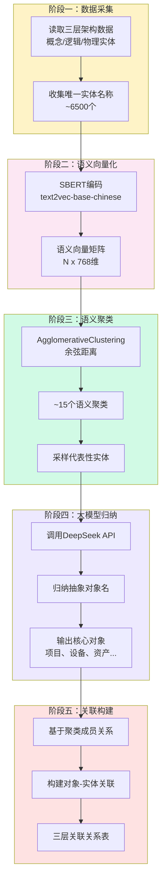

<div align="center">
  <h1>YIMO - 对象抽取与三层架构关联系统</h1>
  <p><strong>Object Extraction & Three-Tier Architecture Association</strong></p>
  <p>
    
    
    
    
    
  </p>
</div>

---

## 30秒快速了解

**YIMO** 是一个智能对象抽取与三层架构关联系统，从数据架构表单中自动识别和抽取高度抽象的"对象"（如项目、设备、资产等），并建立与三层架构（概念实体、逻辑实体、物理实体）的关联关系。

### 核心概念

**三层架构**：

| 层级 | 说明 | 数据来源 |
|------|------|----------|
| **概念实体** (Concept) | 业务场景层，定义业务概念 | DA-01 概念实体清单 |
| **逻辑实体** (Logical) | 交互表单层，定义数据项和属性 | DA-02 逻辑实体清单 |
| **物理实体** (Physical) | 数据库层，定义存储结构 | DA-03 物理实体清单 |

**对象 (Object)**：从三层架构实体中抽取的高度抽象概念，如：
- 项目 (Project) - 电网建设项目
- 设备 (Device) - 电气设备
- 资产 (Asset) - 固定资产
- 合同 (Contract) - 业务合同

---

## 快速部署

### 方式一：Docker 部署（推荐）

```bash
# 克隆项目
git clone https://github.com/YOUR_USERNAME/YIMO.git
cd YIMO

# 一键启动
./docker-start.sh

# 访问 http://localhost:5000
```

### 方式二：本地部署

**环境要求**: Python 3.10+ | MySQL 8.0+ | 8GB+ 内存

```bash
# 克隆并部署
git clone https://github.com/YOUR_USERNAME/YIMO.git
cd YIMO
./deploy.sh

# 访问 http://localhost:5000
```

---

## 对象抽取算法

### 核心思路：自下而上的归纳抽取

采用**语义聚类 + 大模型归纳**的方法，而非传统的预定义关键词匹配：

```
实体名称收集 → SBERT向量化 → 语义聚类 → 大模型归纳命名 → 核心对象输出
```

### 算法流程

> 完整流程图：[figures/architecture/object_extraction_algorithm.mmd](figures/architecture/object_extraction_algorithm.mmd)



### 算法特点

| 特性 | 旧方法（自上而下） | 新方法（自下而上） |
|------|-------------------|-------------------|
| 核心思路 | 预定义关键词 → 匹配分类 | 语义聚类 → LLM归纳命名 |
| 对象发现 | 只能发现预设的对象 | 自动发现数据中的对象 |
| 关联关系 | 基于关键词包含匹配 | 基于聚类成员关系 |
| 扩展性 | 需手动添加关键词 | 自适应新数据 |

---

## 使用方法

### 命令行运行

```bash
# 执行对象抽取（语义聚类 + 规则命名）
python scripts/object_extractor.py \
    --data-dir DATA \
    --target-clusters 15 \
    --no-db \
    --output result.json

# 使用大模型归纳命名
python scripts/object_extractor.py \
    --data-dir DATA \
    --target-clusters 15 \
    --use-llm \
    --db-host localhost \
    --db-port 3307 \
    --db-name eav_db
```

### Web 界面操作

1. 访问 `http://localhost:5000`
2. 点击 **"开始对象抽取"** 按钮
3. 查看抽取的对象卡片
4. 点击对象卡片查看三层架构关联关系
5. 导出结果为 JSON 文件

---

## 数据库结构

### EAV 核心表

| 表名 | 说明 |
|------|------|
| `eav_datasets` | 数据集元信息 |
| `eav_entities` | 实体（每行数据） |
| `eav_attributes` | 属性定义 |
| `eav_values` | 值存储 |

### 语义相似度表

| 表名 | 说明 |
|------|------|
| `eav_semantic_canon` | 规范值（SBERT聚类后的代表文本） |
| `eav_semantic_mapping` | 原始值 → 规范值映射 |
| `semantic_fingerprints` | 实体语义向量存储 |

### 对象抽取表

| 表名 | 说明 |
|------|------|
| `extracted_objects` | 抽取的核心对象 |
| `object_synonyms` | 对象同义词 |
| `object_attribute_definitions` | 对象属性定义 |
| `object_entity_relations` | **对象与三层架构关联关系（核心）** |
| `object_extraction_batches` | 抽取批次记录 |

### 关联关系表结构

```sql
CREATE TABLE object_entity_relations (
    relation_id BIGINT AUTO_INCREMENT PRIMARY KEY,
    object_id INT NOT NULL,                                    -- 对象ID
    entity_layer ENUM('CONCEPT', 'LOGICAL', 'PHYSICAL'),      -- 实体层级
    entity_name VARCHAR(512),                                  -- 实体名称
    entity_code VARCHAR(256),                                  -- 实体编码
    relation_type ENUM('DIRECT', 'INDIRECT', 'DERIVED', 'CLUSTER'),
    relation_strength DECIMAL(5,4),                            -- 关联强度 0-1
    match_method ENUM('EXACT', 'CONTAINS', 'SEMANTIC', 'LLM', 'SEMANTIC_CLUSTER'),
    data_domain VARCHAR(128),                                  -- 数据域
    source_file VARCHAR(256),                                  -- 来源文件
    FOREIGN KEY (object_id) REFERENCES extracted_objects(object_id)
);
```

---

## 项目结构

```
YIMO/
├── README.md                 # 项目说明文档
├── CLAUDE.md                 # AI 助手指南
├── requirements.txt          # Python 依赖
│
├── scripts/                  # 核心处理脚本
│   ├── object_extractor.py   # 对象抽取器（核心算法）
│   ├── eav_full.py           # Excel → EAV 导入
│   ├── eav_csv.py            # CSV → EAV 导入
│   ├── eav_semantic_dedupe.py # SBERT 语义去重
│   ├── import_all.py         # 批量导入入口
│   └── check_db_semantic.py  # 数据库健康检查
│
├── webapp/                   # Flask Web 应用
│   ├── app.py                # 主应用
│   ├── olm_api.py            # 对象抽取 API
│   ├── start_web.sh          # 启动脚本
│   ├── stop_web.sh           # 停止脚本
│   └── templates/
│       ├── 10.0.html         # 主界面 v10.0
│       └── object_extraction.html
│
├── DATA/                     # 数据文件目录
│   ├── 1.xlsx                # 数据集1
│   ├── 2.xlsx                # 数据架构（三层架构核心）
│   └── 3.xlsx                # 数据集3
│
├── figures/                  # 架构图
│   └── architecture/
│       └── object_extraction_algorithm.mmd
│
├── mysql-local/              # MySQL 配置
│   ├── bootstrap.sql         # 数据库初始化
│   └── my.cnf                # MySQL 配置
│
├── docker-compose.yml        # Docker 编排
├── Dockerfile                # 容器构建
└── deploy.sh                 # 部署脚本
```

---

## API 接口

### 对象抽取 API

| 接口 | 方法 | 说明 |
|------|------|------|
| `/api/olm/extracted-objects` | GET | 获取抽取的对象列表 |
| `/api/olm/object-relations/<code>` | GET | 获取对象与三层架构的关联关系 |
| `/api/olm/relation-stats` | GET | 获取对象关联统计 |
| `/api/olm/run-extraction` | POST | 执行对象抽取 |
| `/api/olm/export-objects` | GET | 导出对象和关联关系 |
| `/api/olm/objects` | POST | 创建新对象 |
| `/api/olm/objects/<code>` | PUT | 更新对象 |
| `/api/olm/objects/<code>` | DELETE | 删除对象 |

### RAG 检索 API

| 接口 | 方法 | 说明 |
|------|------|------|
| `/rag/query` | POST | RAG 向量检索 + LLM 问答 |
| `/deepseek/chat` | POST | Deepseek API 代理 |

---

## 配置说明

### 环境变量

```bash
# 数据库配置
MYSQL_HOST=127.0.0.1
MYSQL_PORT=3307
MYSQL_DB=eav_db
MYSQL_USER=eav_user
MYSQL_PASSWORD=eavpass123

# 模型配置
EMBED_MODEL=shibing624/text2vec-base-chinese
MODEL_CACHE=/path/to/models

# API 配置
DEEPSEEK_API_KEY=your_api_key
DEEPSEEK_API_BASE=https://api.deepseek.com/v1
```

### 对象抽取参数

| 参数 | 默认值 | 说明 |
|------|--------|------|
| `--target-clusters` | 15 | 目标聚类数量（最多20） |
| `--use-llm` | False | 使用大模型归纳命名 |
| `--no-db` | False | 不写入数据库 |
| `--output` | None | 输出 JSON 文件路径 |

---

## 预置核心对象

系统预置以下核心对象（可通过大模型扩展）：

| 对象编码 | 对象名称 | 类型 | 说明 |
|----------|----------|------|------|
| OBJ_PROJECT | 项目 | CORE | 电网建设项目 |
| OBJ_DEVICE | 设备 | CORE | 电气设备 |
| OBJ_ASSET | 资产 | CORE | 固定资产 |
| OBJ_CONTRACT | 合同 | CORE | 业务合同 |
| OBJ_PERSONNEL | 人员 | CORE | 相关人员 |
| OBJ_ORGANIZATION | 组织 | CORE | 组织机构 |
| OBJ_DOCUMENT | 文档 | AUXILIARY | 业务文档 |
| OBJ_PROCESS | 流程 | AUXILIARY | 业务流程 |

---

## 变更日志

### v2.2.0 (2026-02) - 语义聚类对象抽取

- **自下而上的归纳抽取**：从预定义关键词匹配改为语义聚类 + LLM归纳
- **SBERT语义向量化**：使用 text2vec-base-chinese 对实体名称向量化
- **层次聚类算法**：AgglomerativeClustering 控制聚类数量（~15个）
- **大模型归纳命名**：LLM 为每个聚类归纳高度抽象的对象名称
- **聚类关联关系**：基于聚类成员关系构建对象-实体关联
- **必须对象保证**：确保"项目"等甲方要求的对象存在

### v2.1.0 (2026-01) - 对象抽取与三层架构关联

- **对象抽取器**：从DATA表单中抽取高度抽象的核心对象
- **三层架构关联**：建立对象与概念实体、逻辑实体、物理实体的关联关系
- **关联强度计算**：使用 SBERT 语义相似度计算关联强度
- **前端可视化**：对象卡片、三层关联视图展示

### v1.0.0 (2024-10)

- EAV 数据模型导入（Excel/CSV）
- SBERT 语义去重引擎
- Flask Web 可视化
- RAG + Deepseek API 集成

---

## 常见问题

### Q: 如何添加新的业务域数据？

将新的 Excel 数据架构文件放入 `DATA/` 目录，确保包含 DA-01/DA-02/DA-03 三个工作表，然后重新执行对象抽取。

### Q: 如何调整聚类数量？

通过 `--target-clusters` 参数调整，建议范围 10-20：

```bash
python scripts/object_extractor.py --target-clusters 20 --use-llm
```

### Q: 如何确保特定对象被抽取？

在 `object_extractor.py` 的 `REQUIRED_OBJECTS` 列表中添加必须的对象名称：

```python
REQUIRED_OBJECTS = ["项目", "设备", "资产"]
```

---

## 贡献

欢迎提交 Issue 和 Pull Request！

## 许可证

MIT License

---

<div align="center">
  <p>Made with for Smart Grid Data</p>
  <p><strong>YIMO - 对象抽取与三层架构关联系统</strong></p>
</div>
