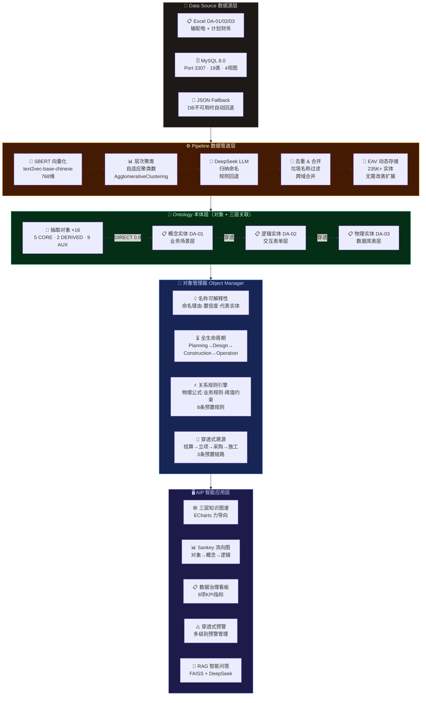
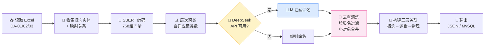
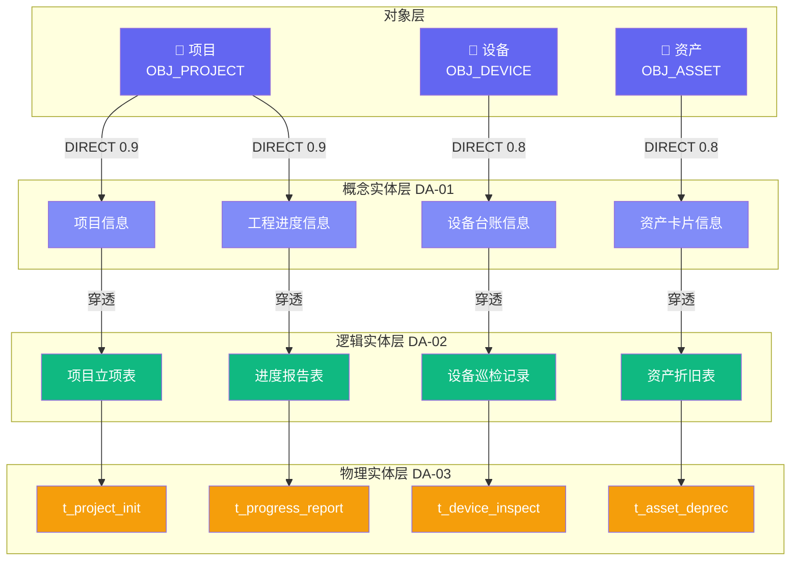
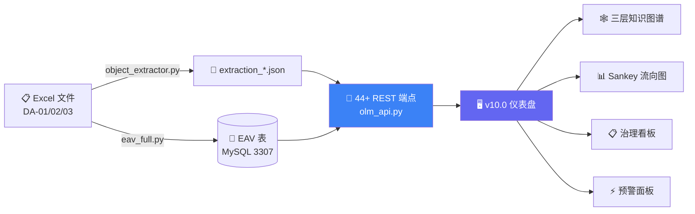
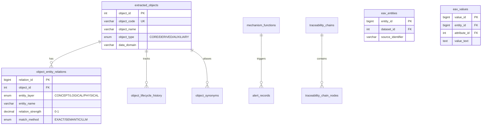

# YIMO — 对象抽取与三层架构关联系统

[](https://python.org)
[](https://flask.palletsprojects.com/)
[](https://mysql.com)
[](https://echarts.apache.org/)
[](tests/)
[](LICENSE)

> 智能电网数据架构对象抽取与三层架构关联可视化平台（南方电网 China Southern Power Grid）

从企业数据架构文档（DA-01/02/03 Excel）中 **自动抽取** 高度抽象的业务"对象"（项目、设备、资产、合同等），建立与三层架构（概念实体→逻辑实体→物理实体）的穿透式关联关系，提供多维可视化与智能治理能力。

---

## 系统架构



> 📐 产品设计与 Palantir 对标：[docs/product/product-design-0.md](docs/product/product-design-0.md) | Palantir Foundry 解析：[docs/product/Palantir Foundry.md](docs/product/Palantir%20Foundry.md) | 甲方需求：[docs/requirement-1/](docs/requirement-1/)

## 对象抽取算法



## 三层架构关联模型



## 数据流



## 核心功能

| 功能 | 说明 |
|------|------|
| **对象自动抽取** | SBERT 语义聚类 + DeepSeek LLM 归纳命名，自动从三层实体中提炼业务对象 |
| **名称可解释性** | 每个对象可查看命名理由、代表实体、置信度评分，支持在线重命名 |
| **三层知识图谱** | ECharts 力导向图，对象→概念→逻辑→物理 四层穿透可视化 |
| **Sankey 流向图** | 对象→概念→逻辑实体的数据流向展示 |
| **全生命周期管理** | 统一 4 阶段时间线（规划→设计→建设→运行）+ 16 对象 × 4 阶段 = 64 条标准记录 + 属性快照 + 阶段间 diff + 甘特图 |
| **生命周期分析** | 跨对象阶段时长对比、瓶颈检测、报告导出 |
| **穿透式溯源** | 从财务结算→项目立项→采购合同→现场施工的全链路追踪 |
| **机理函数** | 自定义业务规则（阈值/公式/规则），如合同额度>300万走审计路径 |
| **风险预警** | 基于机理函数自动触发预警，支持多级别预警管理 |
| **数据治理看板** | 完整性、缺陷率、跨域对比等 8 项治理指标 |
| **多域管理** | 输配电、计划财务等多数据域独立管理与切换 |
| **RAG 智能问答** | FAISS 向量检索 + DeepSeek 生成式回答 |
| **EAV 动态存储** | Entity-Attribute-Value 模型，灵活扩展属性无需改表 |

## 快速开始

```bash
# 一键启动（推荐）
bash start.sh

# 访问主界面
open http://localhost:5000/

# 对象抽取（DeepSeek API Key 存在时自动使用 LLM 命名）
python scripts/object_extractor.py --data-dir DATA --data-domain shupeidian --no-db -o outputs/extraction_shupeidian.json

# 强制使用规则命名（无需 API Key）
python scripts/object_extractor.py --no-llm --data-dir DATA --data-domain jicai --no-db -o outputs/extraction_jicai.json
```

## 系统启停

```bash
bash start.sh              # 启动（MySQL 检查 → venv 激活 → Flask → 健康检查）
bash start.sh --stop       # 停止
bash start.sh --restart    # 重启
bash start.sh --status     # 查看状态
bash start.sh --port 8080  # 指定端口
bash start.sh --extract    # 启动前先运行对象抽取
```

## 数据目录

```
DATA/
├── shupeidian/     # 输配电域（3 个 Excel，~26MB）
└── jicai/          # 计划财务域（3 个 Excel，~11MB）
```

每个 Excel 文件需包含标准化工作表：
- `DA-01 数据实体清单-概念实体清单`（概念实体 → 业务场景层）
- `DA-02 数据实体清单-逻辑实体清单`（逻辑实体 → 交互表单层）
- `DA-03数据实体清单-物理实体清单`（物理实体 → 数据库层）

## API 接口

### 对象管理

| 接口 | 方法 | 说明 |
|------|------|------|
| `/api/olm/extracted-objects` | GET | 获取对象列表（支持域过滤） |
| `/api/olm/object-relations/<code>` | GET | 对象的三层实体关联 |
| `/api/olm/run-extraction` | POST | 执行对象抽取 |
| `/api/olm/merge-objects` | POST | 合并对象 |
| `/api/olm/cross-domain-duplicates` | GET | 跨域重复对象检测 |

### 可视化

| 接口 | 方法 | 说明 |
|------|------|------|
| `/api/olm/graph-data-three-tier` | GET | 三层架构知识图谱（支持深度 2/3/4 层） |
| `/api/olm/graph-data-global` | GET | 全局知识图谱 |
| `/api/olm/sankey-data` | GET | Sankey 流向图数据 |

### 生命周期与溯源

| 接口 | 方法 | 说明 |
|------|------|------|
| `/api/olm/object-lifecycle/<code>` | GET/POST | 对象生命周期 |
| `/api/olm/lifecycle-stats` | GET | 生命周期阶段分布统计 |
| `/api/olm/lifecycle-analytics` | GET | 生命周期分析（阶段时长/瓶颈检测/跨对象对比） |
| `/api/olm/lifecycle-report/<code>` | GET | 单对象生命周期报告导出 |
| `/api/olm/traceability-chains` | GET/POST | 穿透式溯源链 |
| `/api/olm/trace-object/<code>` | GET | 对象溯源追踪 |

### 机理函数与预警

| 接口 | 方法 | 说明 |
|------|------|------|
| `/api/olm/mechanism-functions` | GET/POST | 机理函数管理 |
| `/api/olm/mechanism-functions/evaluate` | POST | 规则求值 |
| `/api/olm/alerts` | GET | 预警列表 |
| `/api/olm/alerts/run-check` | POST | 触发预警检查 |

### 数据治理

| 接口 | 方法 | 说明 |
|------|------|------|
| `/api/olm/governance/metrics` | GET | 治理指标（完整性/缺陷/覆盖率） |
| `/api/olm/governance/defects` | GET | 缺陷报告 |
| `/api/olm/governance/domain-comparison` | GET | 跨域对比 |

## 技术栈

| 层级 | 技术 |
|------|------|
| **后端** | Python 3.10+, Flask 3.0 |
| **数据库** | MySQL 8.0 (InnoDB, UTF8MB4, port 3307) |
| **ML/AI** | SBERT (text2vec-base-chinese, 768维), scikit-learn |
| **向量检索** | FAISS (IndexFlatIP, RAG) |
| **LLM** | DeepSeek API（自动检测 API Key，支持离线规则回退） |
| **前端** | HTML5/Jinja2, CSS3, ECharts 5.0 |
| **部署** | Docker, Docker Compose, Bash |

## 项目结构

```
YIMO/
├── start.sh                       # 一键启停管理
├── scripts/
│   ├── object_extractor.py        # 核心：SBERT + LLM 语义聚类抽取
│   ├── simple_extractor.py        # 轻量：规则抽取（无 SBERT 依赖）
│   ├── eav_full.py                # Excel → EAV 导入
│   └── eav_semantic_dedupe.py     # SBERT 语义去重
├── webapp/
│   ├── app.py                     # Flask 应用（RAG, DeepSeek 代理）
│   ├── olm_api.py                 # REST API（44+ 端点）
│   └── templates/10.0.html        # v10.0 全功能仪表盘
├── tests/                         # pytest 测试套件（159 测试）
├── DATA/                          # 数据域目录（Excel 文件）
├── outputs/                       # 抽取结果 JSON
├── mysql-local/                   # MySQL Schema（19 表 + 4 视图）
├── docs/
│   ├── product/                   # 产品设计 & Palantir 对标
│   │   ├── product-design-0.md    # 产品设计文档 v2.0
│   │   ├── Palantir Foundry.md    # Palantir Foundry 深度解析
│   │   └── Palantir深度调研报告.md # Palantir 调研报告
│   ├── requirement-1/             # 甲方需求文档
│   │   ├── xuqiu.md               # 核心需求（愿景）
│   │   └── xuqiu1.md              # 甲方澄清（执行标准）
│   └── plan/                      # 项目计划 & 团队分工
├── docker-compose.yml             # Docker 编排
└── Dockerfile                     # 多阶段构建
```

## 数据库设计



## 部署方式

```bash
# 方式 1: 本地启动（推荐）
bash start.sh

# 方式 2: Docker Compose
docker compose up -d

# 方式 3: 交互式部署（多 OS 支持）
bash deploy.sh
```

## 测试

```bash
source venv/bin/activate
pytest tests/ -v    # 159 个测试（EAV 51 + 抽取 33 + API 45 + 简化 17）
```

## 配置

```bash
# .env 文件（可选）
MYSQL_HOST=127.0.0.1
MYSQL_PORT=3307
MYSQL_DB=eav_db
MYSQL_USER=eav_user
MYSQL_PASSWORD=eavpass123
DEEPSEEK_API_KEY=your_api_key        # 设置后自动启用 LLM 命名
DEEPSEEK_API_BASE=https://api.deepseek.com/v1
```

## 更新记录

### 2026-03-20 — 名称可解释性 + 生命周期管理完善

**优化方向一：对象名称可解释性**

| 改动 | 说明 |
|------|------|
| API 暴露可解释性字段 | `extraction_source`、`extraction_confidence`、`llm_reasoning`、`sample_entities`、`cluster_size` 现在通过 `/api/olm/extracted-objects` 返回 |
| 动态生成命名理由 | 对 DB 中 `llm_reasoning` 为空的对象，API 层根据 `sample_entities` 自动生成中文命名解释 |
| 名称解释弹窗 | 对象卡片旁新增 ℹ️ 图标，点击弹出命名方法、置信度进度条、命名理由、代表实体列表 |
| 对象卡片样本实体 | 卡片底部显示前 3 个代表实体标签，让用户直观理解聚类内容 |

**优化方向二：全生命周期管理完善**

| 改动 | 说明 |
|------|------|
| 64 条统一演示数据 | 16 个对象 × 4 阶段全覆盖（统一模板生成），含业务属性 JSON 快照 |
| 4 阶段统一模型 | 删除 Finance（财务由 governance 看板承载），改为 Planning→Design→Construction→Operation |
| 对象选择器 | 生命周期面板内置下拉框，无需切回对象面板选择 |
| 阶段停留天数 | 时间线每个阶段圆点下方显示停留天数 |
| 属性 diff | 相邻阶段间高亮显示属性变化（新增/修改/删除） |
| ECharts 甘特图 | 时间线下方展示各阶段时长的横向甘特图 |
| 生命周期分析 API | `GET /api/olm/lifecycle-analytics` — 阶段平均/最长时长、瓶颈检测 |
| 跨对象对比图表 | ECharts 堆叠横向柱状图，16 个对象按阶段着色对比 |
| 报告导出 API | `GET /api/olm/lifecycle-report/<code>` — 单对象生命周期 JSON 报告 |

**修改文件清单**

| 文件 | 改动量 |
|------|--------|
| `mysql-local/bootstrap.sql` | +44 条 lifecycle INSERT |
| `webapp/olm_api.py` | +3 新端点 + `_generate_name_explanations()` + sample_entities 补充 |
| `webapp/templates/10.0.html` | 时间线增强 + 甘特图 + 对象选择器 + 名称解释弹窗 + 对比图表 |

## License

MIT
