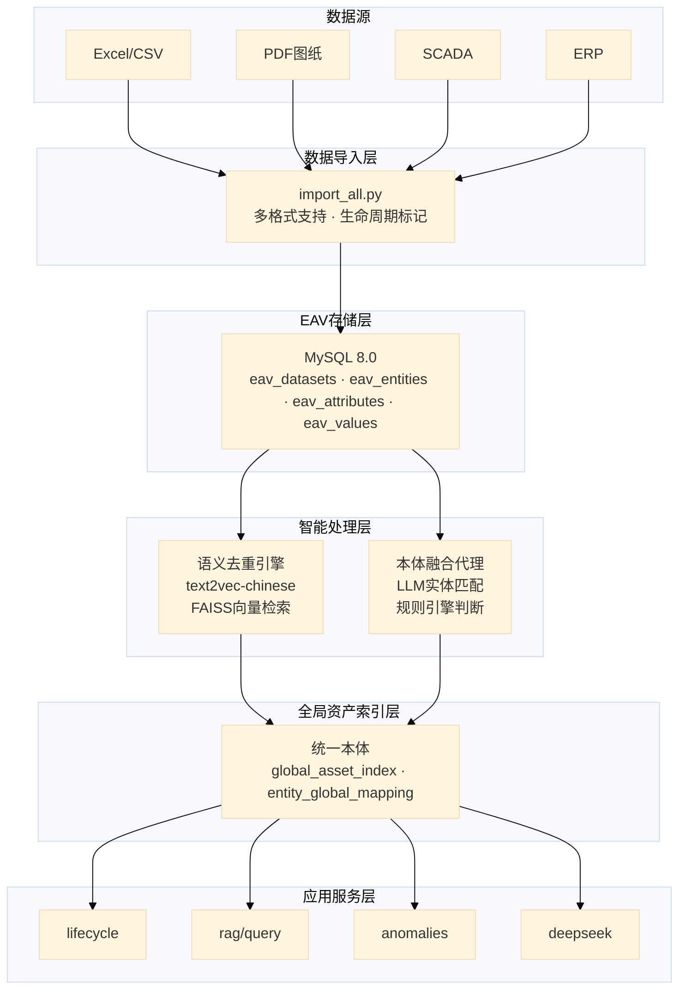
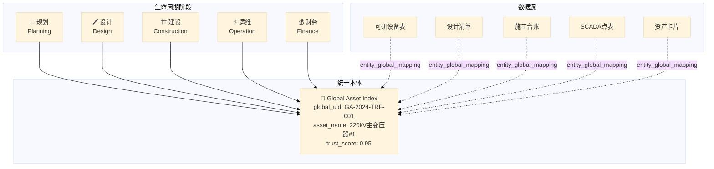
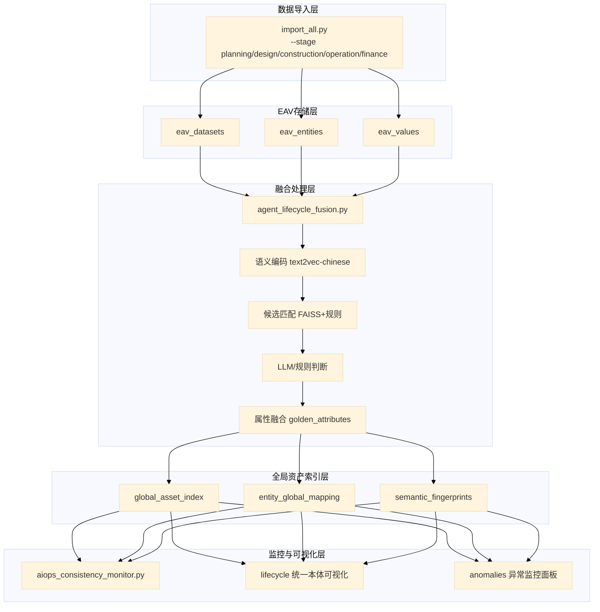

<div align="center">
  <h1>🔌 YIMO - 智能电网 EAV 数据管理与语义去重平台</h1>
  <p><strong>一模到底 · Universal Lifecycle Ontology Manager</strong></p>
  <p>
    
    
    
    
    
  </p>
</div>

---

## 🎯 30秒快速了解

**YIMO** = **Y**our **I**ntelligent **M**aster **O**ntology（一模到底）

> 用**一个统一的本体模型**贯穿智能电网资产从规划到运营的**全生命周期**，解决"同一资产在不同系统中身份不统一"的核心痛点。

**您的数据现状（痛点）**

| 可研系统 | 设计系统 | 施工系统 | SCADA | 财务ERP |
|:--------:|:--------:|:--------:|:-----:|:-------:|
| "1#主变" | "主变一" | "主变压器1" | "TRF001" | "资产-变1" |

> ❌ **同一设备，5个名字，无法关联追踪！**

⬇️ **YIMO 一模到底** ⬇️

**解决方案（统一本体）**

| 项目 | 内容 |
|:-----|:-----|
| 🔘 全局唯一身份 | `GA-2024-TRF-001` |
| 📊 黄金属性 | `{"容量":"120MVA", "电压":"220kV"}` |
| 🔗 全生命周期追踪 | 规划 → 设计 → 建设 → 运维 → 财务 |
| ✅ 可信度评分 | 95% |

---

## 🛠️ 技术路线图

> 📄 流程图源文件：[figures/architecture/tech_roadmap.mmd](figures/architecture/tech_roadmap.mmd)



---

## 🚀 一键部署

### 方式一：Docker 部署（推荐，无需预装 MySQL）

```bash
# 克隆项目
git clone https://github.com/YOUR_USERNAME/YIMO.git
cd YIMO

# 一键启动（自动拉取 MySQL 镜像）
./docker-start.sh

# 或直接使用 docker compose
docker compose up -d

# 访问 http://localhost:5000
```

> 只需安装 Docker，无需预装 Python/MySQL，真正零依赖一键启动！

**Docker 常用命令**:
```bash
docker compose logs -f      # 查看日志
docker compose down         # 停止服务
docker compose down -v      # 停止并清理数据
```

### 方式二：本地部署（需预装 MySQL）

**环境要求**: Python 3.10+ | MySQL 8.0+ | 8GB+ 内存

```bash
# 克隆并部署
git clone https://github.com/YOUR_USERNAME/YIMO.git
cd YIMO
./deploy.sh                    # 基础部署
./deploy.sh --with-demo-data   # 含样例数据

# 访问 http://localhost:5000
```

> 脚本会自动: 创建虚拟环境 → 安装依赖 → 配置数据库 → 启动服务

---

## 💻 日常操作

```bash
# 启动服务
cd /root/YIMO && source venv/bin/activate && cd webapp && python app.py

# 后台运行
cd /root/YIMO/webapp && nohup python app.py > /tmp/webapp.log 2>&1 &

# 停止服务
fuser -k 5000/tcp

# 检查状态
curl http://localhost:5000/health
```

---

## 📋 项目概述

YIMO 是一个面向智能电网数据的完整解决方案，提供以下核心功能：

1. **EAV 数据模型**：将 Excel/CSV 数据导入到 MySQL 的标准 EAV（Entity-Attribute-Value）模型
2. **语义去重**：基于 SBERT 句向量的文本语义聚类与去重，支持多 GPU 加速
3. **Web 可视化**：Flask Web 应用提供数据浏览、RAG 查询和 Deepseek API 集成
4. **🆕 一模到底本体管理器**：全生命周期资产本体融合与数据一致性监控

---

## 🌐 一模到底：全生命周期本体管理器

### 核心理念：一模到底 (Universal Lifecycle Ontology)

"一模到底"是YIMO的核心架构理念——**用一个统一的本体模型贯穿资产从规划到运营的全生命周期**。

> 📄 流程图源文件：[figures/architecture/lifecycle_ontology.mmd](figures/architecture/lifecycle_ontology.mmd)



### 四大支柱

#### 1. 全局资产索引 (Global Asset Index) - "统一本体"
统一本体是每个资产的唯一"身份证"，存储经过融合的黄金属性值：

```sql
-- 核心表结构
CREATE TABLE global_asset_index (
    global_uid VARCHAR(64) PRIMARY KEY,  -- 全局唯一ID
    asset_name VARCHAR(255),              -- 资产名称
    asset_type VARCHAR(100),              -- 资产类型
    trust_score DECIMAL(5,4) DEFAULT 0.5, -- 可信度分数
    golden_attributes JSON,               -- 黄金属性（融合后的权威值）
    fusion_status ENUM('pending','partial','complete')
);
```

#### 2. 智能本体融合代理 (Lifecycle Fusion Agent)
基于 LLM + 规则引擎的实体匹配与属性融合：

```bash
# 运行融合代理
python scripts/agent_lifecycle_fusion.py \
    --batch-size 100 \
    --similarity-threshold 0.85 \
    --llm-api "http://localhost:11434/v1"  # 可选：本地Ollama
```

**融合逻辑**：
- 🔍 候选生成：语义相似度 + 规则匹配（编号、名称）
- 🤖 LLM 判断：调用大模型判断实体是否同一
- 📊 属性融合：按阶段优先级合并属性（后阶段覆盖前阶段）
- ✅ 信任评分：基于数据完整性和一致性计算

#### 3. AIOps 一致性哨兵 (Consistency Monitor)
实时监控数据质量与时序一致性：

```bash
# 运行一致性检查
python scripts/aiops_consistency_monitor.py --check-all
```

**检测规则**：
| 规则 | 说明 | 严重级别 |
|------|------|----------|
| `temporal_violation` | 时序违规（如运维日期早于建设日期） | error |
| `value_drift` | 数值漂移（如容量从100MVA变为50MVA） | warning |
| `missing_stage` | 缺失阶段（有运维数据但无建设记录） | warning |
| `orphan_entity` | 孤立实体（未关联到任何全局资产） | info |

#### 4. 统一本体可视化 (Lifecycle Visualization)
轨道式可视化界面，5个卫星围绕统一本体运转：

```
访问: http://localhost:5000/lifecycle
```

### 数据流向

> 📄 流程图源文件：[figures/architecture/data_flow.mmd](figures/architecture/data_flow.mmd)



### 快速开始：一模到底

```bash
# 1. 初始化数据库（包含生命周期表）
mysql -u root -p eav_db < mysql-local/bootstrap.sql

# 2. 按阶段导入数据
python scripts/import_all.py --stage planning --incremental ./dataset/可研/
python scripts/import_all.py --stage design --incremental ./dataset/设计/
python scripts/import_all.py --stage construction --incremental ./dataset/建设/
python scripts/import_all.py --stage operation --incremental ./dataset/运维/

# 3. 运行融合代理（建立统一本体）
python scripts/agent_lifecycle_fusion.py --batch-size 100

# 4. 运行一致性监控
python scripts/aiops_consistency_monitor.py --check-all

# 5. 启动 Web 服务
cd webapp && ./start_web.sh

# 访问
# http://localhost:5000/lifecycle  - 统一本体可视化
# http://localhost:5000/anomalies  - 异常监控
```

---

## 🏗️ 项目结构

```
YIMO/
├── README.md                 # 项目说明文档
├── requirements.txt          # Python 依赖
│
├── scripts/                  # 核心处理脚本
│   ├── eav_full.py           # Excel → EAV 导入（支持生命周期阶段）
│   ├── eav_csv.py            # CSV → EAV 导入
│   ├── eav_semantic_dedupe.py  # SBERT 语义去重主脚本
│   ├── import_all.py         # 批量导入入口（支持阶段标记）
│   │
│   ├── agent_lifecycle_fusion.py   # 🆕 LLM驱动的本体融合代理
│   ├── aiops_consistency_monitor.py # 🆕 AIOps数据一致性监控
│   │
│   ├── auto_finalize_global.py # 全局去重自动收尾脚本
│   ├── check_db_semantic.py    # 数据库健康检查
│   ├── create_normalized_view.sql # 规范化视图 SQL
│   ├── run_sql_file.py       # SQL 文件执行器
│   └── run_dedupe_full.sh    # 完整去重运行脚本
│
├── webapp/                   # Flask Web 应用
│   ├── app.py                # 主应用（RAG + 生命周期API）
│   ├── start_web.sh          # 启动脚本
│   ├── stop_web.sh           # 停止脚本
│   └── templates/
│       ├── 10.0.html         # 🆕 主界面v10（含一模到底入口）
│       ├── lifecycle_manager.html  # 🆕 统一本体可视化独立页
│       └── anomalies.html    # 🆕 异常监控面板
│
├── DATA/                     # 🆕 数据文件目录
│   ├── 1.xlsx                # 原始数据集1
│   ├── 2.xlsx                # 原始数据集2
│   ├── 3.xlsx                # 原始数据集3
│   └── lifecycle_demo/       # 🆕 生命周期样例数据
│       ├── generate_demo_data.py  # 样例数据生成脚本
│       ├── planning/         # 规划阶段（可研设备清单.xlsx）
│       ├── design/           # 设计阶段（设计图纸设备表.xlsx）
│       ├── construction/     # 建设阶段（施工台账.xlsx）
│       ├── operation/        # 运维阶段（SCADA点表.xlsx、巡检记录.xlsx）
│       └── finance/          # 财务阶段（资产卡片.xlsx）
│
├── doc/                      # 🆕 用户文档目录
│   ├── requirements/         # 需求文档
│   ├── design/               # 设计文档
│   └── manuals/              # 用户手册
│
├── mysql-local/              # 本地 MySQL 配置
│   ├── my.cnf                # MySQL 配置文件
│   ├── bootstrap.sql         # 🆕 数据库初始化（含生命周期表）
│   └── init_local_mysql.sh   # 初始化脚本
│
├── bat/                      # Windows 批处理脚本（Navicat SSH隧道）
│   ├── mysql_tunnel_4090_start.bat  # SSH 隧道启动
│   └── mysql_tunnel_4090_stop.bat   # SSH 隧道停止
│
├── outputs/                  # 运行输出
│   └── semantic_dedupe_gpu_full/
│       ├── single/           # 单数据集去重结果
│       └── global/           # 跨数据集全局去重结果
│
└── venv/                     # Python 虚拟环境（不上传Git）
```

---

## ✨ 核心功能

### 1. EAV 数据导入

将 Excel/CSV 文件转换为标准 EAV 数据模型：

- 自动建库/建表，兼容 MySQL 5.7/8.0/MariaDB
- 智能类型推断：text / number / datetime / bool
- 处理中文与缺项（NaN/NULL/N/A/空白等）
- 支持多表单（sheet）批量导入

```bash
# Excel 导入
python scripts/eav_full.py --excel ./dataset/1.xlsx

# CSV 导入
python scripts/eav_csv.py --csv ./data.csv --db eav_db
```

### 2. 语义去重

基于 SBERT 的文本语义聚类去重：

- 使用 `shibing624/text2vec-base-chinese` 中文句向量模型
- 余弦相似度阈值聚类（默认 0.86）
- 支持多 GPU 并行加速（已验证 4× RTX 4090 D）
- 跨数据集全局去重（同名属性合并聚类）
- 离线模式支持（回退 TF-IDF）

```bash
# 单数据集模式
python scripts/eav_semantic_dedupe.py \
    --dataset-id 1 \
    --model /path/to/text2vec-base-chinese \
    --device cuda --multi-gpu -1 \
    --batch-size 512 --threshold 0.86

# 全局去重模式
python scripts/eav_semantic_dedupe.py \
    --dataset-ids 1,2,3 --global-dedupe \
    --device cuda --multi-gpu -1
```

### 3. Web 可视化

Flask Web 应用提供：

- 数据集/属性/规范值浏览
- FAISS 向量索引的 RAG 检索
- Deepseek API 代理集成

```bash
cd webapp
./start_web.sh   # 启动
./stop_web.sh    # 停止
```

---

## 📊 数据库模型

### EAV 核心表

| 表名 | 说明 |
|------|------|
| `eav_datasets` | 数据集元信息 |
| `eav_entities` | 实体（每行数据） |
| `eav_attributes` | 属性定义 |
| `eav_values` | 值存储 |

### 语义辅助表

| 表名 | 说明 |
|------|------|
| `eav_semantic_canon` | 规范值（每个簇的代表文本） |
| `eav_semantic_mapping` | 原文→规范值映射 |


---

## 📈 运行状态

### 当前进度

| 模块 | 状态 | 说明 |
|------|------|------|
| EAV 数据导入 | ✅ 完成 | 支持 Excel/CSV 多表单导入 |
| 语义去重引擎 | ✅ 完成 | SBERT + 多 GPU 加速 |
| 全局去重模式 | ✅ 完成 | 跨数据集同名属性合并 |
| Web 可视化 | ✅ 完成 | Flask + RAG + Deepseek |
| 自动收尾脚本 | ✅ 完成 | 汇总报告自动生成 |

### 示例运行结果

```
全局去重运行统计（示例）：
- 处理文件数：166
- 映射记录数：22,273
- 聚类簇数：12,582
- 总频次覆盖：555,300
```

---

## ⚙️ 配置说明

### 环境变量

```bash
# 数据库配置
MYSQL_HOST=127.0.0.1
MYSQL_PORT=3306
MYSQL_DB=eav_db
MYSQL_USER=eav_user
MYSQL_PASSWORD=eavpass123

# 模型配置
EMBED_MODEL=shibing624/text2vec-base-chinese
MODEL_CACHE=/path/to/models

# API 配置
DEEPSEEK_API_KEY=your_api_key
```

### 语义去重参数

| 参数 | 默认值 | 说明 |
|------|--------|------|
| `--threshold` | 0.85 | 余弦相似度阈值（越高越严格） |
| `--batch-size` | 512 | 编码批大小 |
| `--max-values` | 5000 | 每属性最大候选文本数 |
| `--multi-gpu` | 0 | -1 使用全部 GPU，>0 指定张数 |


---

## 📝 变更日志

### v2.0.0 (2026-01) - 一模到底

- ✅ **全生命周期本体管理器**：规划→设计→建设→运维→财务全链路
- ✅ **统一本体可视化**：轨道式资产生命周期追踪界面
- ✅ **LLM 融合代理**：智能实体匹配与属性融合
- ✅ **AIOps 一致性哨兵**：数据质量实时监控
- ✅ **增量导入**：支持按阶段标记的数据导入
- ✅ **样例数据生成器**：一键生成完整生命周期样例

### v1.0.0 (2024-10)

- ✅ EAV 数据模型导入（Excel/CSV）
- ✅ SBERT 语义去重引擎
- ✅ 多 GPU 并行加速
- ✅ 跨数据集全局去重
- ✅ Flask Web 可视化
- ✅ RAG + Deepseek API 集成
- ✅ 自动收尾与报告生成

---

## 🖼️ 界面预览

### 主界面 (v10.0)
访问 `http://localhost:5000/?v=10.0` 即可看到：
- 🏠 首页：数据集浏览、RAG检索、AI对话
- 🔘 一模到底：点击导航栏进入统一本体可视化

### 功能入口
| 功能 | URL | 说明 |
|------|-----|------|
| 主界面 | `/?v=10.0` | EAV数据浏览 + 一模到底入口 |
| 统一本体可视化 | `/lifecycle` | 全生命周期资产追踪（独立页面） |
| 异常监控 | `/anomalies` | 数据质量告警面板 |
| 健康检查 | `/health` | 系统状态API |

---

## ❓ 常见问题

### Q: 如何导入我自己的数据？

1. 将Excel文件放入对应阶段目录（如`DATA/my_project/planning/`）
2. 运行导入命令：
```bash
python scripts/import_all.py --stage Planning --dir DATA/my_project/planning/
```

### Q: 如何修改数据库连接？

编辑 `webapp/.env` 或设置环境变量：
```bash
export MYSQL_HOST=127.0.0.1
export MYSQL_PORT=3306
export MYSQL_DB=eav_db
export MYSQL_USER=eav_user
export MYSQL_PASSWORD=eavpass123
```

### Q: 统一本体可视化没有数据？

需要先运行融合代理建立全局资产索引：
```bash
python scripts/agent_lifecycle_fusion.py --batch-size 100
```

### Q: 如何生成新的样例数据？

```bash
cd DATA/lifecycle_demo
python generate_demo_data.py
```

---

## 🤝 贡献

欢迎提交 Issue 和 Pull Request！

## 📜 许可证

MIT License

---

<div align="center">
  <p>Made with ❤️ for Smart Grid Data</p>
  <p><strong>YIMO - 一模到底</strong></p>
  <p>让每一个资产都有唯一的"身份证"</p>
</div>
