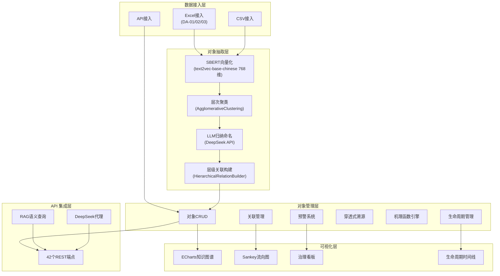
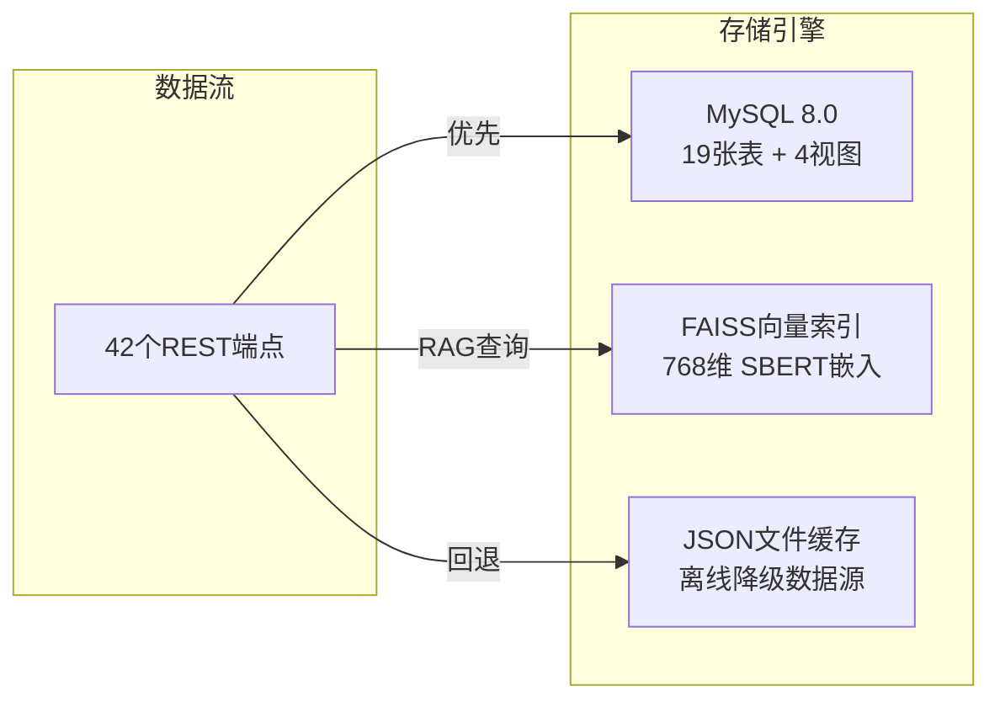
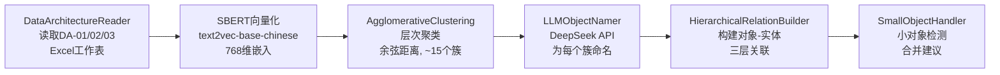
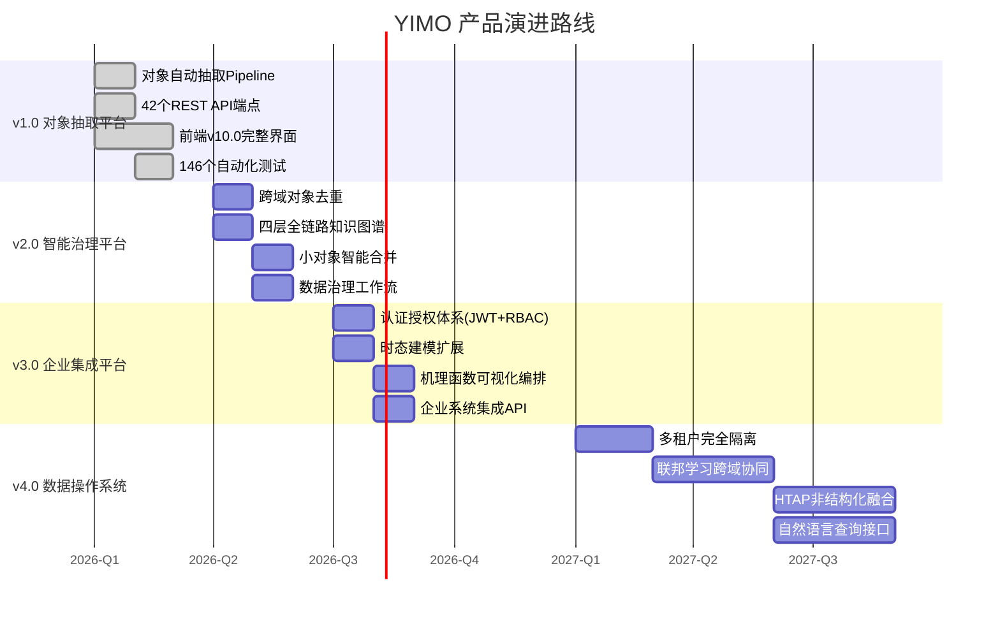

# YIMO 产品设计文档 — 企业级对象管理平台

> **版本**: v1.0
> **日期**: 2026-03-15
> **适用读者**: 企业数据架构师、技术决策者、产品经理、投资方

---

## 1. 产品定位与愿景

### 1.1 行业痛点

南方电网的数字化系统历经多年建设，形成了 ERP、财务、物资、生产等多套独立业务系统。这些系统采用"表单驱动"的数据管理方式——每个部门围绕自身业务流程设计出库单、入库单、审批单等表单，导致同一业务实体在不同系统中存在定义不一致、语义不统一、数据无法互通的问题。典型场景是：当财务部门需要对一笔结算单据进行穿透式审计时，必须人工在多个系统间反复切换，才能从结算报告追溯到项目立项、合同签订、现场施工记录。这种"数据打架"和"看不透"的问题，已成为电力行业数字化转型的核心瓶颈。

### 1.2 对标分析：Palantir Foundry Ontology

Palantir Foundry 通过 Ontology 层将企业数据统一为对象模型，是全球范围内最成熟的数据操作系统。然而 Foundry 面向通用行业，对象建模依赖人工定义 Object Types，需要大量领域专家参与，且年费百万级别的订阅模式和 SaaS 优先的部署方式，与电力行业"内网隔离、自主可控、成本敏感"的需求存在根本矛盾。

### 1.3 YIMO 差异化价值

YIMO（对象管理层）定位为**面向电力行业的企业级对象管理平台**，核心理念是实现从"表单驱动"到"对象驱动"的范式转换。与 Palantir Foundry 相比，YIMO 具备三个差异化优势。第一，**自动抽取而非人工建模**：基于 SBERT 语义聚类和 LLM 归纳命名，从数据架构文档中自动发现和抽取业务对象，将传统需要数周的对象建模工作压缩到分钟级别。第二，**电力行业深度适配**：原生支持南方电网 DA-01/02/03 三层架构标准，内置电力设备、项目、资产等领域知识，无需二次定制。第三，**内网部署零依赖**：Docker 一键部署，支持完全离线运行，SBERT 模型本地加载，LLM 可替换为本地 Qwen/ChatGLM，满足电力行业严格的网络隔离要求。

### 1.4 目标用户

YIMO 面向四类核心用户。**企业数据架构师**负责定义和维护数据标准，使用 YIMO 自动抽取对象并建立三层架构关联，替代传统的人工梳理工作。**数据治理团队**利用治理看板监控数据完整性和一致性，识别属性缺漏和定义冲突。**业务分析人员**通过穿透式溯源功能，从财务报表一路追溯到底层业务数据，实现全链路审计。**IT 运维人员**负责系统部署和 API 集成，将 YIMO 对接到现有企业系统。

---

## 2. 核心概念模型

### 2.1 对象（Object）

对象是 YIMO 的核心抽象，定义为**从三层架构实体中归纳抽取的高度抽象业务概念**。与传统数据库表或业务表单不同，对象代表真实世界中的客观实体——一台变压器、一份合同、一个工程项目——独立于任何特定系统的数据表示方式而存在。

YIMO 将对象划分为三种类型。**CORE（核心对象）** 是业务运转的基础实体，包括项目（OBJ_PROJECT）、设备（OBJ_DEVICE）、资产（OBJ_ASSET）、合同（OBJ_CONTRACT）、人员（OBJ_PERSONNEL）、组织（OBJ_ORGANIZATION）等。核心对象通常与多个三层架构实体存在直接关联，是穿透式溯源的锚点。**DERIVED（派生对象）** 由核心对象的业务活动产生，包括任务（OBJ_TASK）、指标（OBJ_METRIC）、成本等。派生对象依附于核心对象存在，在知识图谱中表现为从核心对象出发的衍生节点。**AUXILIARY（辅助对象）** 为业务流程提供支撑，包括文档（OBJ_DOCUMENT）、流程（OBJ_PROCESS）等。辅助对象的关联关系通常较弱，但对完整性审计不可或缺。

对象的属性体系采用 EAV（Entity-Attribute-Value）动态模型。与传统关系型建模不同，EAV 允许在不修改数据库 Schema 的情况下为对象动态添加新属性。每个属性定义包含属性名称、编码、数据类型（STRING/NUMBER/DATE/ENUM）、是否必填、是否为关键属性等元信息。更重要的是，YIMO 支持**时态属性**——同一对象在不同生命周期阶段拥有不同的属性集合。例如，一台变压器在"规划阶段"具有额定容量、预算金额等规划属性，进入"运行阶段"后则关联运行温度、负载率等运维属性。

对象编码遵循统一规范：`OBJ_` 前缀 + 大写英文标识，如 OBJ_PROJECT、OBJ_DEVICE、OBJ_ASSET。编码在同一数据域内唯一，跨域对象通过语义相似度进行去重和关联。

### 2.2 本体（Ontology）

YIMO 的本体模型建立在南方电网数据架构的三层架构标准之上，将业务世界的复杂性分解为三个层次。

**概念实体（CONCEPT，DA-01）** 对应业务场景层。DA-01 工作表定义了企业的业务概念和场景描述，例如"数字化项目管理""资产全生命周期管理"等。概念实体是最高层次的抽象，描述业务"做什么"而非"怎么做"。

**逻辑实体（LOGICAL，DA-02）** 对应交互表单层。DA-02 工作表定义了支撑业务场景的具体表单和交互逻辑，例如"项目立项申请表""合同审批单"等。逻辑实体是概念实体的实现载体，描述业务"怎么做"。

**物理实体（PHYSICAL，DA-03）** 对应数据库层。DA-03 工作表定义了实际存储数据的数据库表和字段，例如"t_project_info""t_contract_detail"等。物理实体是逻辑实体的技术实现，描述数据"存在哪"。

对象与三层架构实体之间的关联通过 `object_entity_relations` 表管理，每条关联记录包含四个关键维度。**关联类型**分为 DIRECT（直接关联，对象名称与实体名称高度匹配）、INDIRECT（间接关联，通过中间概念实体建立联系）、DERIVED（派生关联，从已有关联推导）和 CLUSTER（聚类关联，由语义聚类算法自动发现）。**关联强度**是 0-1 之间的连续值，聚类核心成员的强度为 0.9，外围成员为 0.7，间接关联通常在 0.6-0.7 之间。**匹配方法**记录关联的建立方式——EXACT（精确匹配）、CONTAINS（包含匹配）、SEMANTIC（SBERT 语义相似度）、LLM（大模型判定）或 SEMANTIC_CLUSTER（语义聚类）。**层级路径**通过 `via_concept_entity` 字段记录间接关联的穿透路径，例如逻辑实体"项目立项申请表"通过概念实体"项目管理"间接关联到对象"项目"。

与 Palantir Foundry 的 Ontology Manager 相比，YIMO 的本体模型有两个本质区别。Foundry 的 Ontology 需要管理员手动定义 Object Types 及其属性和关系，是一个"自上而下"的建模过程。YIMO 则是"自下而上"的自动发现——从 DA-01/02/03 文档中自动抽取实体，通过语义聚类归纳为对象，再自动建立三层关联。此外，Foundry 的关系是离散的（有或无），YIMO 的关联具有连续的强度值和可追溯的匹配方法，为数据治理提供了更精细的质量评估依据。

### 2.3 机理函数（Action）

机理函数是挂载在对象上的业务逻辑单元，定义了对象之间或对象属性之间的计算规则和约束条件。YIMO 支持三种类型的机理函数。

**THRESHOLD（阈值检查）** 对对象属性值进行边界检测。当属性值超过预设阈值时触发预警或流程分支。例如，预置的 `MF_CONTRACT_AUDIT` 函数检查合同金额是否超过 300 万元审计红线，超过则要求走 A 级审批路径。表达式以 JSON 格式存储：`{"field": "合同金额", "operator": ">", "value": 3000000, "unit": "元", "action": "ALERT"}`。

**FORMULA（物理公式）** 定义对象属性之间的计算关系，特别适用于电力行业的物理量计算。例如，预置的 `MF_POWER_FORMULA` 定义了功率=电压×电流的计算关系。表达式包含变量列表、计算公式和结果单位。

**RULE（业务规则）** 定义条件-动作逻辑，实现业务流程的自动判定。例如，`MF_APPROVAL_RULE` 根据合同金额自动决定审批路径——金额大于 300 万走 A 级审批，否则走 B 级审批。

YIMO 内置表达式求值引擎，支持对机理函数的实时评估。通过 `/api/olm/mechanism-functions/evaluate` 端点，可以传入输入变量值，获取函数的计算结果或规则判定结论。与 Palantir Foundry 的 Action 机制相比，YIMO 的机理函数更侧重电力行业的物理公式和财务规则，而 Foundry 的 Action 更偏向通用的工作流编排。

---

## 3. 系统架构设计

### 3.1 整体架构（五层模型）

YIMO 采用分层架构设计，从底层数据接入到顶层 API 输出分为五个层次。以下 Mermaid 图展示了整体架构。



**数据接入层**负责多源数据的标准化导入。当前主要支持 Excel 文件（DA-01/02/03 标准化工作表），通过 `DataArchitectureReader` 类自动识别三层架构实体。同时支持 CSV 批量导入和 API 实时接入。数据接入后进入 EAV 动态模型，自动检测字段数据类型并存储。

**对象抽取层**是 YIMO 的核心算法层，实现从原始实体到抽象对象的自动归纳。完整的抽取 Pipeline 包含五个步骤：DataArchitectureReader 读取三层架构数据、SemanticClusterExtractor 进行 SBERT 语义聚类、LLMObjectNamer 调用大模型为聚类命名、HierarchicalRelationBuilder 构建对象与实体的层级关联、SmallObjectHandler 处理小对象的合并和优化。

**对象管理层**提供对象全生命周期的管理能力，包括 CRUD 操作、生命周期阶段管理（Planning → Design → Construction → Operation → Finance）、穿透式溯源链路管理、机理函数定义与求值、预警规则评估与记录。

**可视化层**基于 ECharts 实现多维度的数据呈现。知识图谱以力导向布局展示对象与三层架构实体的关联网络，节点按层级着色——概念层紫色（#6366f1）、逻辑层绿色（#10b981）、物理层橙色（#f59e0b）。Sankey 流向图展示对象到三层架构的四层流向关系。治理看板提供 8 项指标的实时监控。

**API 集成层**通过 42 个 REST 端点对外提供全部功能，覆盖对象 CRUD、可视化数据、分析查询、治理指标、生命周期、溯源、机理函数、预警等六大类别。同时提供 RAG 语义查询接口和 DeepSeek LLM 代理接口。

### 3.2 数据存储架构

YIMO 的数据存储采用三种引擎协同工作的混合架构。

**关系型存储（MySQL 8.0）** 承载核心业务数据，包含 19 张表和 4 个视图。表结构按功能分为四组：EAV 核心表（4 张：eav_datasets/eav_entities/eav_attributes/eav_values）负责灵活的属性存储；对象抽取表（7 张：extracted_objects/object_synonyms/object_attribute_definitions/object_entity_relations/object_business_object_mapping/object_extraction_batches/object_batch_mapping）管理抽取结果和关联关系；语义分析表（3 张：eav_semantic_canon/eav_semantic_mapping/semantic_fingerprints）支撑语义去重和向量存储；业务功能表（5 张：object_lifecycle_history/traceability_chains/traceability_chain_nodes/mechanism_functions/alert_records）实现生命周期、溯源、机理函数和预警功能。4 个视图（v_object_relation_stats/v_domain_stats/v_governance_completeness/v_governance_defects）提供预聚合的统计和治理数据。

**向量存储（FAISS）** 使用 IndexFlatIP 索引存储 SBERT 生成的 768 维语义嵌入向量，支撑 RAG 语义查询。查询时通过内积计算 top-K 最相似的文本片段，作为上下文提供给 LLM 生成回答。

**JSON 离线缓存** 是 YIMO 的容错机制。所有 42 个 API 端点实现"数据库优先 + JSON 回退"的双数据源策略。当 MySQL 不可用时，自动从 `outputs/extraction_<domain>.json` 文件加载数据，确保前端功能不中断。当前输配电域的 JSON 缓存包含 10 个对象和 11,928 条关联关系（约 6.7MB），计划财务域包含 7 个对象和 1,294 条关联（约 734KB）。



### 3.3 对象抽取算法架构

对象抽取采用"自下而上"的归纳方法，核心 Pipeline 如下：



**自适应聚类参数**：目标聚类数量默认为 15，最大不超过 20。当实体总数较少时，系统自动减少聚类数量以避免过度细分。聚类使用凝聚层次聚类算法（Agglomerative Clustering），距离度量为余弦距离，链接方式为 ward 方法。

**三级回退策略**确保系统在不同环境下均可运行。完整模式使用 SBERT 语义聚类 + DeepSeek LLM 命名，适用于有网络连接的开发环境。半离线模式使用 SBERT 聚类 + 规则命名，适用于无 LLM API 但有 SBERT 模型的环境。纯离线模式通过 `simple_extractor.py` 使用 20+ 关键词规则进行基于模式匹配的抽取，适用于完全离线且无 ML 依赖的环境。

**必须对象保障**：甲方明确要求"项目"必须被抽取。系统通过 `REQUIRED_OBJECTS = ["项目"]` 配置和 `_ensure_required_objects()` 保障机制，在聚类结果中检查必须对象是否存在，缺失时自动补充。

---

## 4. 多租户与多域架构

### 4.1 数据域隔离方案

YIMO 当前采用**目录级隔离**方案。每个数据域对应 `DATA/` 目录下的一个子文件夹，如 `DATA/shupeidian/`（输配电域）和 `DATA/jicai/`（计划财务域）。每个域目录包含标准化的 DA-01/02/03 Excel 文件。系统通过 `/api/domains` 端点自动发现所有数据域，前端提供域选择器。数据库中通过 `data_domain` 字段实现行级过滤，所有对象、关联、溯源链路等记录都携带域标识。

产品化阶段将升级为**数据库 Schema 级隔离 + 行级过滤**的混合方案。大型客户的不同业务部门（如输配电事业部、计划财务部、营销部）将拥有独立的数据库 Schema，物理隔离核心数据。同时保留 `data_domain` 字段作为 Schema 内部的逻辑隔离手段，支持更细粒度的数据分区。新增数据域时，只需在 `DATA/` 目录下创建包含标准 Excel 文件的子文件夹，系统自动发现并注册，无需修改配置或重启服务。域配置可通过 `domain.json` 文件自定义域名称和元数据。

### 4.2 跨域对象统一

不同数据域中可能存在语义相同但名称不同的对象，例如输配电域的"设备台账"和计划财务域的"资产设备"实际指向同一业务实体。YIMO 通过三个机制实现跨域对象统一。

**跨域重复检测**基于 SBERT 语义相似度计算不同域中对象名称的相似度，当相似度超过阈值时标记为潜在重复。去重决策记录在 `object_dedup_decisions` 表中，支持 MERGED（合并）、LINKED（关联）和 IGNORED（忽略）三种处理方式。

**统一对象编码体系**通过 `OBJ_` 前缀 + 大写英文标识的编码规范，确保跨域对象的编码一致性。OBJ_PROJECT 在所有域中指向同一语义概念，域间差异通过 `data_domain` 字段区分。

**跨域关联发现**通过治理看板的"跨域对比矩阵"功能，展示不同域中对象的关联覆盖差异。例如，"项目"对象在输配电域关联了 2,000+ 个三层实体，但在计划财务域仅关联 300+ 个，提示可能存在数据缺失。

---

## 5. API 设计与企业集成

### 5.1 REST API 设计原则

YIMO 提供 42 个 REST 端点，按功能划分为六大类别，覆盖对象管理的完整生命周期。

| 类别 | 端点数 | 典型端点 | 功能说明 |
|------|--------|----------|----------|
| 对象 CRUD | 5 | `GET /api/olm/extracted-objects` | 对象的增删改查和导出 |
| 可视化数据 | 4 | `GET /api/olm/graph-data-global` | 知识图谱、Sankey 流向图、颗粒度报告 |
| 分析查询 | 6 | `GET /api/olm/stats` | 系统统计、域统计、汇总看板、实体搜索 |
| 治理指标 | 4 | `GET /api/olm/governance/metrics` | 完整性、缺陷、跨域对比 |
| 生命周期与溯源 | 7 | `POST /api/olm/traceability-chains` | 生命周期阶段管理、溯源链路 CRUD |
| 机理函数与预警 | 10 | `POST /api/olm/mechanism-functions/evaluate` | 函数 CRUD、表达式求值、预警触发和处理 |
| 抽取管理 | 3 | `POST /api/olm/run-extraction` | 执行抽取、批次管理、对象合并 |
| 基础服务 | 3 | `POST /rag/query` | RAG 语义查询、DeepSeek 代理、健康检查 |

所有端点遵循统一的设计原则。响应格式为标准 JSON，包含数据和元信息。错误处理返回明确的 HTTP 状态码和错误描述。核心数据端点实现"数据库优先 + JSON 回退"的双数据源策略——首先尝试从 MySQL 查询数据，连接失败时自动从 `outputs/extraction_<domain>.json` 文件加载缓存数据，确保前端在数据库不可用时仍能正常工作。

### 5.2 认证授权方案（产品化规划）

当前版本所有 API 端点公开访问，不包含认证机制。产品化阶段将引入完整的认证授权体系。

**JWT Token 认证**将作为主要的身份验证机制。用户登录后获取 Access Token（有效期 2 小时）和 Refresh Token（有效期 7 天）。所有 API 请求通过 `Authorization: Bearer <token>` 头传递凭证。Token 采用 RS256 算法签名，支持密钥轮换。

**RBAC 角色权限模型**定义四个角色层级。管理员拥有全部权限，包括用户管理、系统配置和数据域管理。数据架构师可执行对象抽取、关联管理和机理函数定义。业务分析师可查看和使用溯源、预警等分析功能。只读用户仅能浏览数据和导出报告。

**API Key 管理**面向系统间集成场景。每个对接系统分配独立的 API Key，绑定特定的权限范围和速率限制。API Key 支持到期自动失效和紧急吊销。

### 5.3 与南方电网系统集成方案

YIMO 设计为南方电网数字化生态的"对象层中台"，通过 REST API 与现有系统双向对接。

**ERP 对接**：YIMO 从 ERP 系统同步项目、设备、资产等核心对象的基础信息，建立 YIMO 对象与 ERP 主数据的映射关系。ERP 中的业务事件触发 YIMO 的生命周期阶段更新。

**财务系统对接**：YIMO 的穿透式溯源链路为财务审计提供从结算单据到项目立项、合同签订、现场施工记录的全链路追溯能力。财务数据变更通过预警系统实时监控。

**物资系统对接**：合同对象和采购对象的属性从物资系统同步，机理函数自动检查合同金额、采购流程的合规性。

**生产系统对接**：设备对象和运维对象的实时运行数据从生产系统获取，挂载在对象的"运行阶段"属性上，支持设备健康状态的穿透式监控。

---

## 6. 安全与权限模型

### 6.1 认证方案

产品化部署将支持三种认证方式以适配不同的企业环境。**企业 SSO 集成**支持 SAML 2.0 和 OAuth 2.0 协议，可对接南方电网现有的统一身份认证平台，实现单点登录。用户在企业门户完成认证后，YIMO 自动获取用户身份和组织信息，无需二次登录。**多因素认证（MFA）** 针对管理员和数据架构师等高权限角色强制启用，支持 TOTP 动态口令和短信验证码两种方式。**API Key 认证**面向系统间集成，每个 Key 绑定固定的 IP 白名单和权限范围。

### 6.2 数据权限

YIMO 的数据权限分为三个层级。**域级权限**控制用户可访问哪些数据域。例如，计划财务部的用户只能访问 `jicai` 域的数据，无法查看输配电域的对象。域权限与 RBAC 角色解耦，支持灵活的交叉授权。**对象级权限**针对敏感对象实施精细控制。例如，涉及财务合同金额的对象（OBJ_CONTRACT）可设置为仅授权用户可见，其他用户在知识图谱和 Sankey 图中看到该节点但无法查看详细属性。**字段级权限**利用 EAV 模型的灵活性，在属性定义表中标记敏感属性。例如，合同金额、人员薪资等字段可设置为仅特定角色可读，其他角色查询时该字段返回掩码值。

### 6.3 审计与合规

**操作审计日志**记录所有用户操作，包括登录、数据查询、对象修改、抽取执行等。日志包含操作人、操作时间、操作类型、受影响的对象、变更前后的值等完整信息。日志存储独立于业务数据库，防止篡改。

**数据变更追溯**基于对象生命周期历史表（`object_lifecycle_history`）实现。每次对象属性变更都会生成一条快照记录，包含变更时间、变更来源系统和变更前后的属性值对比。结合穿透式溯源链路，可以从任意时间点的数据状态追溯到原始业务操作。

**合规报告生成**针对电力行业监管要求，自动生成数据治理合规报告。报告内容包括数据完整性评分、三层关联覆盖率、预警处理及时率、跨域数据一致性等关键指标。报告格式支持 PDF 和 Excel 导出。

---

## 7. 部署方案

### 7.1 本地 Docker 部署（当前方案）

YIMO 当前提供 Docker Compose 一键部署方案，`docker-compose.yml` 编排两个服务：MySQL 8.0 数据库（端口 3307，含健康检查）和 Flask Web 应用（端口 5000，依赖 MySQL 就绪）。数据库初始化通过 `bootstrap.sql` 自动执行，创建全部 19 张表、4 个视图和预置数据。

```bash
# 一键启动
docker compose up -d

# 或使用管理脚本（含MySQL检查、健康监测）
bash start.sh

# 查看状态
bash start.sh --status

# 启动前先执行对象抽取
bash start.sh --extract
```

`start.sh` 管理脚本提供完整的生命周期管理：检测 MySQL 连接状态并在未运行时自动启动、显示数据库摘要统计、自动检测 Python 环境（venv → conda → system）、后台启动 Flask 应用、健康检查验证。

### 7.2 私有云部署（南方电网内网）

南方电网的生产环境通常处于严格的网络隔离状态，YIMO 的私有云部署方案针对此场景做了专项适配。

**离线 LLM 替代**：当无法访问 DeepSeek API 时，将 LLM 组件替换为本地部署的 Qwen-7B 或 ChatGLM-6B 模型。对象命名功能的提示词模板与 LLM 后端解耦，切换模型只需修改 API 地址配置，无需调整算法逻辑。对于资源受限的环境，可使用纯规则回退方案（simple_extractor.py），完全无 LLM 依赖。

**SBERT 模型离线包**：text2vec-base-chinese 模型文件约 400MB，在有网络时预下载到 `models/` 目录。Docker 镜像构建时将模型打包进镜像，或通过 Volume 挂载本地模型目录。系统启动时自动检测本地模型，无网络请求。

**高可用方案**：生产环境使用 Gunicorn 替代 Flask 内置服务器，配置 4-8 个 Worker 进程（取决于 CPU 核数）。MySQL 采用主从复制实现读写分离，主节点处理写操作，从节点分担查询压力。SBERT 模型加载使用 `@lru_cache` 确保全局单例，避免多 Worker 重复加载消耗内存。

### 7.3 容器化与编排（未来）

面向大规模部署场景，YIMO 将支持 Kubernetes 编排。

**水平扩展策略**：Flask Web 应用为无状态服务，可通过 Kubernetes Deployment 水平扩展 Pod 数量。SBERT 模型通过 PersistentVolumeClaim 共享挂载，避免每个 Pod 独立下载。FAISS 索引在每个 Pod 内独立构建（基于共享的数据库数据），无状态同步需求。

**数据持久化方案**：MySQL 数据通过 PersistentVolume 持久化，支持 StorageClass 动态供给。JSON 缓存文件和抽取结果通过 NFS 或 CephFS 共享存储。模型文件通过 ReadOnlyMany PV 挂载到所有 Pod。

---

## 8. 与 Palantir Foundry 对比分析

### 8.1 功能维度对比

| 维度 | YIMO | Palantir Foundry |
|------|------|------------------|
| **核心定位** | 电力行业对象管理平台 | 通用数据操作系统 |
| **对象建模** | SBERT+LLM 自动抽取（分钟级） | 人工定义 Object Types（天/周级） |
| **本体管理** | 三层架构自动映射，关联强度连续可量化 | Ontology Manager 手动配置，关系为离散型 |
| **数据接入** | Excel/CSV 自动导入，DA-01/02/03 原生解析 | Pipeline Builder 可视化编排，支持 100+ 数据源 |
| **数据存储** | MySQL 8.0 EAV + FAISS 向量索引 | 自研分布式存储（Foundry Datasets） |
| **可视化** | ECharts 知识图谱 / Sankey / 治理看板 | Quiver / Slate / Workshop（丰富的可视化套件） |
| **AI 能力** | SBERT 语义聚类 + DeepSeek LLM + RAG | AIP（自研 AI 平台，集成 GPT-4 等） |
| **机理函数** | 3 种类型（THRESHOLD/FORMULA/RULE）+ 求值引擎 | Action（通用工作流引擎 + Python 自定义） |
| **溯源能力** | 穿透式链路（财务→项目→采购→现场） | Lineage（数据集级别血缘追踪） |
| **治理能力** | 4 维度指标（完整性/缺陷/覆盖率/跨域对比） | 数据健康（Data Health）全套工具 |
| **部署方式** | Docker / 私有云 / 完全离线 | SaaS / Private Cloud（需专业团队部署） |
| **行业适配** | 电力行业深度定制（DA 标准、电力对象） | 跨行业通用（需大量定制开发） |
| **定价模式** | 开源 + 定制开发 | 企业级订阅（年费百万至千万级） |
| **学习曲线** | 低（Web 界面 + REST API，无需培训） | 高（需要数周专业培训） |
| **本土化** | 中文 NLP、中文界面、国产数据库兼容 | 英文为主，中文支持有限 |

### 8.2 YIMO 核心优势分析

**优势一：自动化程度更高**。Palantir Foundry 的 Ontology 建模需要领域专家逐一定义 Object Types、Properties 和 Links，是一个人工密集型过程。YIMO 通过 SBERT 语义聚类从 DA-01/02/03 文档中自动发现对象，LLM 自动命名，HierarchicalRelationBuilder 自动构建三层关联——整个过程从人工数周压缩到自动化分钟级。在输配电域的实际运行中，YIMO 从 3 个 Excel 文件中自动抽取了 10 个对象和 11,928 条关联关系，无需任何人工干预。

**优势二：电力行业深度适配**。YIMO 原生支持南方电网 DA-01（概念实体）、DA-02（逻辑实体）、DA-03（物理实体）三层架构标准，内置电力行业常见对象模板（项目、设备、资产、合同等 8 个预置对象）和 3 个预置机理函数（合同金额审计红线、功率计算公式、付款审批路径规则）。计划财务域还预置了 3 条穿透式溯源链路，包含 15 个节点，覆盖结算穿透、合同审计和资产生命周期三个典型场景。Foundry 虽然功能更全面，但对电力行业的适配需要大量定制开发。

**优势三：部署灵活性**。电力行业的生产系统通常部署在严格隔离的内网环境中，无法访问外部 API 和云服务。YIMO 通过三级回退策略（SBERT+LLM → SBERT+规则 → 纯规则）、SBERT 模型离线包、JSON 文件缓存等机制，实现完全离线运行。Docker Compose 一键启动，无需专业运维团队。Foundry 的 Private Cloud 部署需要 Palantir 专业团队现场支持，周期长、成本高。

**优势四：成本优势显著**。YIMO 作为开源方案，核心功能免费。定制开发和技术支持按需付费，总拥有成本远低于 Foundry 的百万至千万级年费订阅。对于预算有限的电力企业，YIMO 提供了一条从"数据散乱"到"对象驱动"的低成本升级路径。

**优势五：本土化与自主可控**。YIMO 使用中文 NLP 模型（text2vec-base-chinese）、中文界面、MySQL 数据库，符合国产化替代要求。代码完全自主可控，无境外技术依赖。Foundry 作为美国公司的产品，在电力等关键基础设施行业的使用可能面临合规审查。

---

## 9. 产品演进路线

### v1.0 — 对象抽取平台（当前版本，已发布）

v1.0 实现了 YIMO 的核心能力闭环。对象自动抽取 Pipeline 完整运行，支持从 DA-01/02/03 Excel 文件中自动提取业务对象并建立三层架构关联。已在输配电和计划财务两个数据域验证，共抽取 17 个对象、13,222 条关联关系。前端提供 v10.0 完整界面，包含对象卡片网格、三列关联面板、ECharts 知识图谱、Sankey 流向图、生命周期时间线、溯源链路面板、机理函数管理与测试、预警系统、治理看板等 11 个功能面板。后端提供 42 个 REST API 端点，全部实现 MySQL + JSON 双数据源策略。数据库包含 19 张表和 4 个视图，完整覆盖 EAV 存储、对象管理、语义分析、生命周期、溯源、机理函数和预警等功能。测试套件包含 146 个测试用例，覆盖核心算法、API 端点、EAV 导入和回退抽取器四个模块。

**v1.0 关键指标**：
- 42 个 REST API 端点
- 19 张数据库表 + 4 个视图
- 146 个自动化测试用例
- 3,115 行 API 代码（olm_api.py）
- 2,164 行核心算法代码（object_extractor.py）
- 2,768 行前端代码（10.0.html）

### v2.0 — 智能治理平台（Q2 2026）

v2.0 聚焦数据治理能力的智能化升级。**跨域对象去重与统一**将实现自动检测不同域中的重复对象，通过语义相似度计算和人工确认相结合的方式完成去重决策，所有决策记录存入 `object_dedup_decisions` 表供审计。**三层全链路知识图谱**将当前的对象-实体二层图谱扩展为对象-概念-逻辑-物理四层力导向图，支持按层级折叠展开，直观呈现从业务概念到数据库表的完整穿透路径。**小对象智能合并**基于颗粒度分析报告，自动识别关联实体数量过少的对象并推荐合并方案，减少对象碎片化。**自适应聚类参数**根据输入实体数量和语义分布特征，自动调整聚类数量和距离阈值，消除手动调参的需求。**数据治理工作流**将治理看板中发现的缺陷转化为可分配的工作任务，支持指派、跟踪和关闭，形成发现-修复-验证的闭环。

### v3.0 — 企业集成平台（Q3 2026）

v3.0 着力打通企业系统边界，实现 YIMO 与南方电网现有系统的深度集成。**认证授权体系**引入 JWT Token 认证和 RBAC 角色权限模型，支持企业 SSO 集成和 API Key 管理。**全生命周期时态建模**扩展对象属性的时态维度，同一对象在 Planning、Design、Construction、Operation、Finance 五个阶段自动切换不同的属性集合，每个阶段变更生成属性快照供历史回溯。**机理函数可视化编排**提供拖拽式的规则编辑器，业务人员无需编写 JSON 表达式即可定义 THRESHOLD、FORMULA 和 RULE 类型的机理函数。**企业系统集成 API**实现与 ERP、财务、物资、生产四大系统的双向数据同步，定义标准化的数据交换格式和事件通知机制。**移动端适配**提供响应式 Web 界面，支持平板和手机端的治理看板查看和预警通知接收。

### v4.0 — 数据操作系统（2027）

v4.0 目标是将 YIMO 从对象管理平台升级为面向电力行业的数据操作系统。**多租户完全隔离**实现 Schema 级别的物理隔离，支持不同子公司或事业部在同一平台上独立运行，数据完全不可见。**联邦学习跨域协同**在数据不出域的前提下，通过联邦学习技术实现跨域对象的联合分析——例如跨多个地市公司的设备健康状态综合评估，而不暴露各地市的具体数据。**数据中台对比引擎**实现 YIMO 抽取的对象与企业数据中台已有的数据资产目录的自动对比，识别差异并生成对齐建议。**HTAP 非结构化数据融合**引入混合事务分析处理技术，将结构化的表单数据与现场视频、图像等非结构化数据关联到同一对象上，实现"结算报告→施工照片→现场视频"的全媒体穿透溯源。**自然语言查询接口**基于 RAG 增强的自然语言理解，用户可直接用中文提问——"输配电域有多少个设备类对象？"系统自动转化为 API 调用并返回结构化结果。



---

## 附录 A：数据库表清单

| 序号 | 表名 | 类型 | 用途 |
|------|------|------|------|
| 1 | `eav_datasets` | 核心表 | 数据集元信息 |
| 2 | `eav_entities` | 核心表 | EAV 实体实例 |
| 3 | `eav_attributes` | 核心表 | EAV 属性定义 |
| 4 | `eav_values` | 核心表 | EAV 属性值存储 |
| 5 | `eav_semantic_canon` | 语义表 | 语义聚类规范值 |
| 6 | `eav_semantic_mapping` | 语义表 | 原始值→规范值映射 |
| 7 | `semantic_fingerprints` | 语义表 | 768 维 SBERT 向量存储 |
| 8 | `extracted_objects` | 对象表 | 抽取的核心对象 |
| 9 | `object_synonyms` | 对象表 | 对象同义词/别名 |
| 10 | `object_attribute_definitions` | 对象表 | 对象属性定义 |
| 11 | `object_entity_relations` | 对象表 | 对象与三层架构关联（核心） |
| 12 | `object_business_object_mapping` | 对象表 | BA-04 业务对象匹配 |
| 13 | `object_extraction_batches` | 对象表 | 抽取批次记录 |
| 14 | `object_batch_mapping` | 对象表 | 对象-批次关联 |
| 15 | `object_lifecycle_history` | 业务表 | 对象生命周期历史 |
| 16 | `traceability_chains` | 业务表 | 穿透式溯源链路定义 |
| 17 | `traceability_chain_nodes` | 业务表 | 溯源链路节点 |
| 18 | `mechanism_functions` | 业务表 | 机理函数定义 |
| 19 | `alert_records` | 业务表 | 预警记录 |
| 20 | `object_dedup_decisions` | 治理表 | 对象去重决策记录 |
| V1 | `v_object_relation_stats` | 视图 | 对象关联统计 |
| V2 | `v_domain_stats` | 视图 | 数据域统计 |
| V3 | `v_governance_completeness` | 视图 | 治理完整性分析 |
| V4 | `v_governance_defects` | 视图 | 治理缺陷识别 |

## 附录 B：技术栈一览

| 层次 | 技术 | 版本 | 用途 |
|------|------|------|------|
| 后端框架 | Flask | 3.0.3 | Web 服务与 API |
| 数据库 | MySQL | 8.0 | 关系型存储（端口 3307） |
| 数据库驱动 | PyMySQL | 1.1.1 | 数据库连接 |
| 语义模型 | SBERT (text2vec-base-chinese) | — | 768 维中文语义嵌入 |
| 向量索引 | FAISS | 1.7.4 | IndexFlatIP 内积相似度检索 |
| 聚类算法 | scikit-learn (AgglomerativeClustering) | 1.3+ | 层次聚类 |
| LLM 集成 | DeepSeek API | — | 对象命名与 RAG 问答 |
| 数据处理 | pandas + openpyxl | 2.0+ / 3.1+ | Excel 解析与数据清洗 |
| 前端可视化 | ECharts | — | 知识图谱、Sankey、柱状图 |
| 容器化 | Docker + Docker Compose | — | 一键部署 |
| 测试框架 | pytest | — | 146 个自动化测试 |
