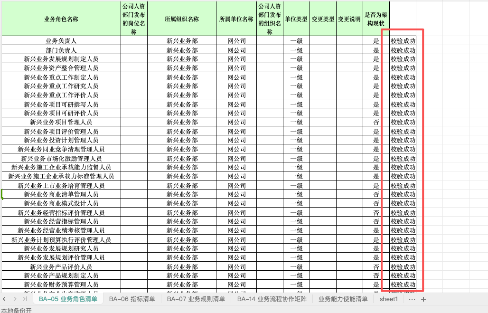

甲方明确：

对象和三层架构的关联指的是对象和逻辑、物理、概念实体的关联关系
项目里面说的三层架构，“客观实体对象”、中间的“交互表单对象”和上层的“业务场景” 这三层的数据在数据架构的excel里有，分别对应 物理实体、逻辑实体和概念实体， 然后我们新定义的 “对象”是根据这些这三个实体的所有相关的信息（在excel里）抽取出来，“对象”类似项目、设备这些，是高度抽象的概念。
我们抽取的对象一定要有“项目”，最后很可能用这个和中台的中心对比
请你帮我，设计从DATA表单（目前是输配电域的三张表，后面还会添加计划财务域等其他域的数据）中抽取“对象”的算法（给我输出一张算法流程图），设计对象和三层架构的关联关系表示，前端界面要看得出对象和三层架构的关联关系，指的是对象和逻辑、物理、概念实体的关联关系。

之前的统一本体那些就全部删掉吧，按甲方新需求来，只保留新需求。EAV建库，SBERT语义相似度匹配那些也保留。之前的v10.0前端界面比较漂亮，我希望界面风格还是保留，但是功能按照新的需求来，老的那个统一本体的那个功能就先全部删掉吧。

3.1更新问题：
1.算法泛化问题，要每个域都用同一个算法；2. 对象抽取这一步目前没问题，但是颗粒度是否符合要求需要再评估：3. 对象与三层实体关联关系： 目前存在对象找不到任何一层实体的问题（建议用业务对象与抽取的对象做匹配，通过表里业务对象与三层实体的关系，得到抽取对象和三层实体的关系）；4. 存在少数对象内实体数量太少（建议与其他对象合并或直接删除）；5. 前端展示：当前展示对象与三层实体关系的方式不够直接， 建议使用知识图谱的展示方式，或者有更好的展示方式可讨论）
一个概念实体里有多个业务对象，一个业务对象只对应一个概念实体
一个概念实体里有多个逻辑实体，一个逻辑实体只对应一个概念实体
逻辑实体和业务对象没有直接关系，是通过概念实体产生关系

所以看你是用概念实体还是用业务对象来和抽取的对象做匹配，感觉概念实体会好一点

3.13更新问题：
1、还存在抽取对象重复的问题
2、对象里只有一个或几个的概念实体（是否删去或者与其他合并）
3、需支持数据模型扩展和检索，并引入全生命周期的概念（随着时间节点变化，对象属性变化）
记录了一下刚才的问题以及后续的工作，第三点我们可以后续讨论下

3.19更新问题：
对象管理器：
1、对象的名字的可解释性
2、对象全生命周期管理功能完善；

低代码：
1、功能、界面改造

对象和对象之间的关系，通过函数或者规则实现，挂载物理公式和规则

这个有打算怎么实现么

4.3更新问题：
对象可解释性完成，机理函数分为三类，财务不是一个阶段（记得改一下）
全生命周期管理功能目前还在设计阶段，把所有对象统一考虑来设计

4.9更新问题：
1、全生命周期功能需要把这个对象里所有的字段都展示出来；
2、链路追踪功能需要设计，如何体现数据可溯源（项目金额是从其他三个字段加起来的）
3、htap性能展示建议不要放在菜单栏里，可以单独作为一个活动页签放在其他地方

4.16更新问题：
/home/qq/YIMO/DATA/数据架构覆盖导入日志(1).zip
/home/qq/YIMO/DATA/网公司应用架构-蓝图-导入日志20250520(1).zip
/home/qq/YIMO/DATA/业务架构覆盖导入日志(1).zip
这是所有域的三个架构的数据，包括了之前我给你的那两个，记得不要重复了
还有每一个表的每一个页签里，最右边的那一列是 校验结果，这一列数据是无关的，要删掉

记得到时候原型系统的名字要和任务书的对应上：
支撑孪生体新范式多维数据融合分析框架原型系统

注意你们前端和后端要符合我们的页面和代码规范
最后要部署到南网服务器

/home/qq/YIMO/docs/code/开发规范.zip
这里面包括代码和前端界面的规范